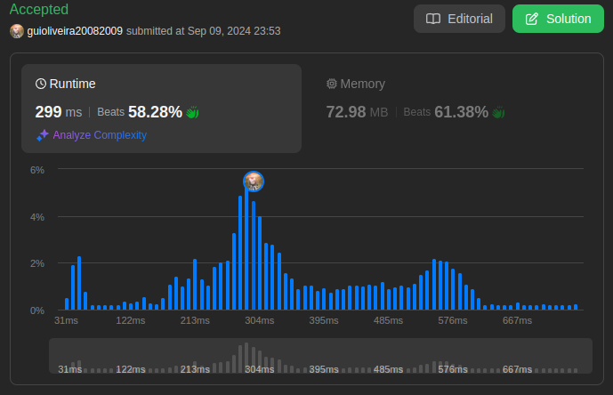

# LeetCode Problems

**Número da Lista**: 17  
**Conteúdo da Disciplina**: PD 

## Aluno
|Matrícula | Aluno |
| -- | -- |
| 18/0113496  |  Guilherme de Oliveira Mendes |

## Sobre 
Neste projeto, será abordado alguns problemas disponíveis na plataforma [LeetCode](https://leetcode.com/) sobre algoritmos de dividir e conquistar. Sendo que os problemas apresentados serão resolvidos utilizando conceitos apredidos em sala de aula.

## Screenshots
[Difícil: 879. Profitable Schemes](https://leetcode.com/problems/profitable-schemes/description/) 

[Difícil: 115. Distinct Subsequences ](https://leetcode.com/problems/distinct-subsequences/description/) 

[Média: 72. Edit Distance](https://leetcode.com/problems/edit-distance/description/) 

## Instalação 
**Linguagem**: Python3    
**Framework**: Não 
**Pré-requisito**: Compilador de Python3.

## Link da Apresentação
[Apresentação PA 17 - LeetCode Problems - Programação Dinâmica](https://www.youtube.com/watch?v=XAQw4_Y_Tvw) 

