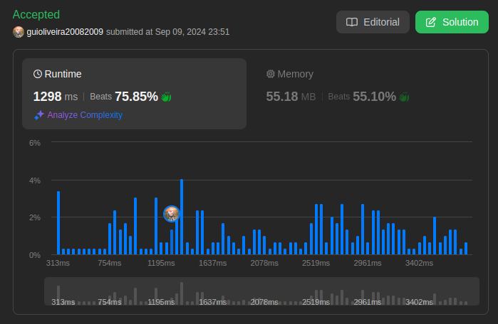
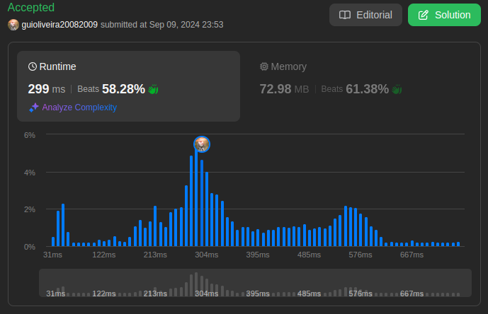
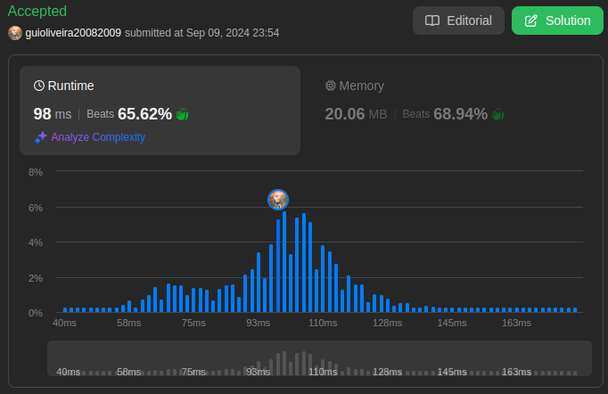

# 932. Beautiful Array

Problema: [Beautiful Array ](https://leetcode.com/problems/beautiful-array/description/)

**Descrição:** <br>

An array nums of length n is beautiful if:

- nums is a permutation of the integers in the range [1, n].
- For every 0 <= i < j < n, there is no index k with i < k < j where 2 * nums[k] == nums[i] + nums[j].
- Given the integer n, return any beautiful array nums of length n. There will be at least one valid answer for the given n.

**Example 1:**

**Input:** n = 4 <br>
**Output:** [2,1,4,3] <br>

**Example 2:**

**Input:** n = 5 <br>
**Output:** [3,1,2,5,4] <br>
 

**Constraints:**

- 1 <= n <= 1000


## Estrutura do Algoritmo
O algoritmo de `Dividir e Conquistar` para resolver o problema **932. Beautiful Array** do LeetCode. O objetivo é gerar um "Beautiful Array" com base em um número inteiro `( N )`. Um array é considerado "beautiful" se, para cada número `( i )`, o array de números restantes quando `( i )` é removido pode ser dividido em duas partes onde cada uma é "beautiful" por si só.


### 1. Preparação do Conjunto Inicial

```python
return dvc(list(range(1, N + 1)))
```

- O método `beautifulArray` começa criando uma lista de números consecutivos de 1 até \( N \). Esta lista é então passada para a função `dvc (Divide and Conquer)`.

#### 2. Função de Divisão e Conquista

```python
def dvc(nums: List[int]) -> List[int]:
    if len(nums) <= 2:
        return nums
    
    even = dvc(nums[::2])
    odd = dvc(nums[1::2])
    
    return even + odd
```

- **Caso Base**: Se o comprimento da lista `nums` for 2 ou menos, retorna a lista tal como está. Isso serve como condição de parada da recursão.

- **Divisão**:
  - **Divisão em Subconjuntos**: Divide a lista em dois subconjuntos:
    - `even`: Contém os elementos na posição par (usando slicing `nums[::2]`).
    - `odd`: Contém os elementos na posição ímpar (usando slicing `nums[1::2]`).
  - **Recursão**: Chama recursivamente a função `dvc` para cada um desses subconjuntos (`even` e `odd`).

- **Combinação**: Após resolver os subproblemas, a função combina as soluções concatenando os resultados dos subconjuntos `even` e `odd`. 

#### 3. Resultado Final

- A função principal `beautifulArray` retorna o resultado da função `dvc` aplicada à lista de números de 1 a \( N \).

### Complexidade do Algoritmo

Vamos analisar a complexidade considerando as operações principais do algoritmo:

- **Divisão**: Em cada nível de recursão, a lista é dividida em duas partes aproximadamente iguais: elementos em posições pares e ímpares. Portanto, o número de elementos em cada chamada recursiva é reduzido pela metade a cada nível.

- **Recursão**: A profundidade da recursão é  `O(log N)`, pois o problema é dividido pela metade a cada nível de recursão.

- **Combinação**: A combinação dos resultados das chamadas recursivas envolve simplesmente a concatenação das listas, o que pode ser feito em tempo linear `O(n)` para cada nível de recursão.

**Complexidade Total**: A complexidade total do algoritmo é `O(n \log n)`, onde `(n)` é o número de elementos na lista inicial. Isso se deve ao fato de que o algoritmo faz `O(log n)` chamadas recursivas, e cada nível de recursão requer uma operação de combinação linear.


**Submissão:**<br>


# 395. Longest Substring with At Least K Repeating Characters

Problema: [Longest Substring with At Least K Repeating Characters](https://leetcode.com/problems/longest-substring-with-at-least-k-repeating-characters/description/)

**Descrição:** <br>

Given a string s and an integer k, return the length of the longest substring of s such that the frequency of each character in this substring is greater than or equal to k.

if no such substring exists, return 0.

 

**Example 1:**

**Input:** s = "aaabb", k = 3 <br>
**Output:** 3 <br>
**Explanation:** The longest substring is "aaa", as 'a' is repeated 3 times.

**Example 2:**

**Input:** s = "ababbc", k = 2 <br>
**Output:** 5 <br>
**Explanation:** The longest substring is "ababb", as 'a' is repeated 2 times and 'b' is repeated 3 times.

**Constraints:**

- 1 <= s.length <= 104
- s consists of only lowercase English letters.
- 1 <= k <= 105


## Estrutura do Algoritmo

O algoritmo de `Dividir e Conquistar` para esta questão divide a string em subproblemas menores e resolve cada um recursivamente para encontrar a maior substring válida. A abordagem é baseada no conceito de dividir o problema em substrings onde certos caracteres não atendem à condição de repetição mínima.

### 1. Divisão do Problema

O método `dvc(Divide and Conquer)` é uma função recursiva que recebe dois índices, `start` e `end`, representando o intervalo da substring atual a ser analisada.

```python
def dvc(start, end):
    if end - start + 1 < k:
        return 0
```

- **Caso Base**: Se a substring tem menos caracteres do que `k`, é impossível que todos os caracteres na substring atendam à condição de repetição mínima. Portanto, retorna 0.

### 2. Contagem de Frequências

```python
count = Counter(s[start:end + 1])
```

- **Contagem de Caracteres**: O `Counter` é usado para contar a frequência de cada caractere na substring `s[start:end + 1]`.

### 3. Divisão com Base em Caracteres

```python
for mid in range(start, end + 1):
    if count[s[mid]] < k:
        left = dvc(start, mid - 1)
        right = dvc(mid + 1, end)
        return max(left, right)
```

- **Identificação de Caracteres Insuficientes**: O loop percorre cada caractere da substring e verifica se a frequência do caractere é menor que `k`.
  - Se encontrar um caractere que aparece menos de `k` vezes, divide a substring em duas partes:
    - **Esquerda**: De `start` até `mid - 1`.
    - **Direita**: De `mid + 1` até `end`.
  - Calcula a maior substring válida das duas partes e retorna o resultado.

### 4. Substrings Válidas

```python
return end - start + 1
```

- **Caso de Substring Válida**: Se todos os caracteres na substring atendem à condição de repetição mínima, então a substring é válida e seu comprimento é retornado.

### Complexidade do Algoritmo

A complexidade do algoritmo é derivada de dois principais fatores: a contagem de caracteres e a recursão.

- **Contagem de Caracteres**: A operação `Counter` para contar a frequência dos caracteres na substring tem uma complexidade de `O(n)`, onde `n` é o tamanho da substring.

- **Recursão**: Em cada chamada recursiva, o algoritmo divide o problema em duas partes com base em caracteres que não atendem à condição mínima. O número de divisões é proporcional ao número de caracteres na substring, e cada divisão pode resultar em duas chamadas recursivas.

**Complexidade Total**: A complexidade do algoritmo é aproximadamente `O(n.2^n)`, onde `(n)` é o comprimento da substring analisada. Isso ocorre porque, em cada nível de recursão, a função pode dividir a substring em múltiplas partes e repetir o processo, levando a um crescimento exponencial no número de chamadas recursivas.


**Submissão:**<br>


# 493. Reverse Pairs

Problema: [Reverse Pairs](https://leetcode.com/problems/reverse-pairs/description/)

**Descrição:**

Given an integer array nums, return the number of reverse pairs in the array.

A reverse pair is a pair (i, j) where:

- 0 <= i < j < nums.length and
- nums[i] > 2 * nums[j].

<br>

**Example 1:**

**Input:** nums = [1,3,2,3,1] <br>
**Output:** 2 <br>
**Explanation:** The reverse pairs are: <br>
(1, 4) --> nums[1] = 3, nums[4] = 1, 3 > 2 * 1 <br>
(3, 4) --> nums[3] = 3, nums[4] = 1, 3 > 2 * 1

**Example 2:**

**Input:** nums = [2,4,3,5,1] <br>
**Output:** 3 <br>
**Explanation:** The reverse pairs are: <br>
(1, 4) --> nums[1] = 4, nums[4] = 1, 4 > 2 * 1 <br>
(2, 4) --> nums[2] = 3, nums[4] = 1, 3 > 2 * 1 <br>
(3, 4) --> nums[3] = 5, nums[4] = 1, 5 > 2 * 1 <br>

**Constraints:**

- 1 <= nums.length <= 5 * 104
- -231 <= nums[i] <= 231 - 1

## Estrutura do Algoritmo

O algoritmo segue o paradigma de `Dividir e Conquistar`, dividindo o problema em subproblemas menores, resolvendo cada um de forma recursiva, e combinando os resultados para obter a solução final.

### 1. Divisão do Problema

O método `mergeSort` divide a lista de números em duas metades:

```python
mid = (start + end) // 2
count = self.merge_sort(nums, start, mid) + self.merge_sort(nums, mid + 1, end)     
```

Aqui, o índice médio `mid` é calculado e a lista `nums` é dividida em duas partes: da posição `left` até `mid`, e de `mid + 1` até `right`. A função `mergeSort` é então chamada recursivamente em cada uma dessas partes, acumulando o número total de pares inversos em `count`.

### 2. Contagem de Pares Inversos

Após dividir a lista, antes de combinar as duas metades, o algoritmo conta os pares inversos que cruzam a divisão (ou seja, onde \(i\) está na primeira metade e \(j\) na segunda metade):

```python
j = mid + 1
for i in range(left, mid + 1):
    while j <= right and nums[i] > 2 * nums[j]:
        j += 1
    count += j - (mid + 1)
```

Neste trecho:
- `j` começa imediatamente após `mid` (início da segunda metade).
- Para cada `i` na primeira metade, o algoritmo procura todos os `j` na segunda metade onde a condição `nums[i] > 2 * nums[j]` é satisfeita.
- Para cada `i`, o número de `j` que satisfaz essa condição é contado e adicionado a `count`.

### 3. Combinação das Soluções

Após contar os pares inversos, o próximo passo é combinar (ou mesclar) as duas metades da lista, de forma ordenada:

```python
self.merge(nums, left, mid, right)
```

O método `merge` é responsável por intercalar as duas sublistas ordenadas:

```python
while i <= mid and j <= right:
    if nums[i] <= nums[j]:
        temp.append(nums[i])
        i += 1
    else:
        temp.append(nums[j])
        j += 1
```

- Os elementos das duas metades são comparados e inseridos em uma lista temporária `temp` em ordem crescente.
- O restante dos elementos de cada metade, se houver, é adicionado à lista `temp`.

Finalmente, a lista original `nums` é atualizada com os elementos ordenados de `temp`.

### 4. Resultado Final

Após todas as chamadas recursivas e a combinação final, o número total de pares inversos é retornado pela função `reversePairs`.

### Complexidade do Algoritmo

A análise da complexidade considera a divisão, contagem de pares inversos e combinação:

- **Divisão:** O problema é dividido em duas partes recursivamente, semelhante ao merge sort, levando a uma profundidade de recursão de `O(log n)`.
  
- **Contagem de Pares Inversos:** A contagem de pares inversos requer percorrer a lista, com complexidade `O(n)` em cada nível de recursão.

- **Combinação:** A combinação das duas metades, que envolve a fusão das sublistas ordenadas, também requer `O(n)` operações em cada nível de recursão.

**Complexidade Total:** Como o algoritmo realiza `O(n)` operações a cada nível de recursão, e há `O(log n)` níveis, a complexidade total é `O(n log n)`.


**Submissão:**




# 218. The Skyline Problem

Problema: [The Skyline Problem ](https://leetcode.com/problems/the-skyline-problem/description/)<br>

**Descrição:** <br>
A city's skyline is the outer contour of the silhouette formed by all the buildings in that city when viewed from a distance. Given the locations and heights of all the buildings, return the skyline formed by these buildings collectively.

The geometric information of each building is given in the array buildings where buildings[i] = [lefti, righti, heighti]:

lefti is the x coordinate of the left edge of the ith building.
righti is the x coordinate of the right edge of the ith building.
heighti is the height of the ith building.
You may assume all buildings are perfect rectangles grounded on an absolutely flat surface at height 0.

The skyline should be represented as a list of "key points" sorted by their x-coordinate in the form [[x1,y1],[x2,y2],...]. Each key point is the left endpoint of some horizontal segment in the skyline except the last point in the list, which always has a y-coordinate 0 and is used to mark the skyline's termination where the rightmost building ends. Any ground between the leftmost and rightmost buildings should be part of the skyline's contour.

Note: There must be no consecutive horizontal lines of equal height in the output skyline. For instance, [...,[2 3],[4 5],[7 5],[11 5],[12 7],...] is not acceptable; the three lines of height 5 should be merged into one in the final output as such: [...,[2 3],[4 5],[12 7],...]

**Example 1:**<br>
**Input:** buildings = [[2,9,10],[3,7,15],[5,12,12],[15,20,10],[19,24,8]]<br>
**Output:** [[2,10],[3,15],[7,12],[12,0],[15,10],[20,8],[24,0]]<br>

**Explanation:**<br>
Figure A shows the buildings of the input.<br>
Figure B shows the skyline formed by those buildings. <br>
The red points in figure B represent the key points in the output list.


**Example 2:**<br>
**Input:** buildings = [[0,2,3],[2,5,3]]<br>
**Output:** [[0,3],[5,0]]<br>

**Constraints**<br>
- 1 <= buildings.length <= 104
- 0 <= lefti < righti <= 231 - 1
- 1 <= heighti <= 231 - 1
- buildings is sorted by lefti in non-decreasing order.

## Estrutura do Algoritmo

O algoritmo segue o paradigma de `Dividir e Conquistar`, dividindo o problema em subproblemas menores, resolvendo cada um de forma recursiva, e combinando os resultados para obter a solução final.

### 1. Divisão do Problema

```python
mid = len(buildings) // 2
leftsky = self.getSkyline(buildings[:mid])
rightsky = self.getSkyline(buildings[mid:])
```

O método `getSkyline` divide o conjunto de edifícios em duas partes aproximadamente iguais. A primeira metade (`buildings[:mid]`) é resolvida recursivamente, resultando em `leftsky`, e a segunda metade (`buildings[mid:]`) também é resolvida recursivamente, resultando em `rightsky`.

### 2. Conquista

Para cada subproblema, se o número de edifícios for 1, a solução é direta:

```python
if len(buildings) == 1:
    l, r, h = buildings[0]
    return [[l, h], [r, 0]]
```

Aqui, o perfil do único edifício é retornado como uma lista de pontos críticos.

### 3. Combinação das Soluções

A função `mergeSkylines` é responsável por combinar as duas soluções parciais (`leftsky` e `rightsky`).

```python
 def mergeSkylines(self, left: List[List[int]], right: List[List[int]]) -> List[List[int]]:
    h1, h2 = 0, 0  
    i, j = 0, 0
    mergedsky = []
        
    while i < len(left) and j < len(right):
        if left[i][0] < right[j][0]:
            x = left[i][0]
            h1 = left[i][1]
            max_h = max(h1, h2)
            if not mergedsky or mergedsky[-1][1] != max_h:
                mergedsky.append([x, max_h])
            i += 1
        elif left[i][0] > right[j][0]:
            x = right[j][0]
            h2 = right[j][1]
            max_h = max(h1, h2)
            if not mergedsky or mergedsky[-1][1] != max_h:
                mergedsky.append([x, max_h])
            j += 1
        else:
            x = left[i][0]
            h1 = left[i][1]
            h2 = right[j][1]
            max_h = max(h1, h2)
            if not mergedsky or mergedsky[-1][1] != max_h:
                mergedsky.append([x, max_h])
            i += 1
            j += 1
        
    while i < len(left):
        mergedsky.append(left[i])
        i += 1
        
    while j < len(right):
        mergedsky.append(right[j])
        j += 1
        
    return mergedsky
```

Este método combina as duas listas de pontos críticos (`left` e `right`):

- `h1` e `h2` representam as alturas atuais dos perfis à esquerda e à direita, respectivamente.
- A cada iteração, o ponto crítico com a menor coordenada `x` é considerado.
- A altura máxima entre `h1` e `h2` é adicionada ao perfil final se for diferente da última altura registrada, garantindo que apenas mudanças de altura sejam refletidas no skyline.

### 4. Resultado Final

Ao final do processo, a combinação das skylines esquerda e direita resulta na skyline completa.

### Complexidade do Algoritmo

A complexidade do algoritmo pode ser analisada considerando o processo de divisão, conquista e combinação:

- **Divisão:** O algoritmo divide o problema em duas metades recursivamente, similar ao merge sort. Ou seja a profundidade da recursão é `O(log n)`, onde `(n)` é o número de edifícios.
  
- **Conquista:** Cada chamada recursiva que processa um subproblema leva tempo constante `O(1)` no caso base, onde há apenas um edifício.

- **Combinação:** A combinação de duas skylines, cada uma de tamanho `(m)` e `(n)`, requer `O(m + n)` operações. No pior caso, todos os edifícios contribuem para o skyline, levando a um tempo de fusão de `O(n)`.

**Complexidade Total:** Considerando a fusão em cada nível de recursão, a complexidade total do algoritmo é `O(n log n)`, onde `n` é o número de edifícios. Esta complexidade é eficiente, dada a natureza do problema.


**Submissão:**<br>
